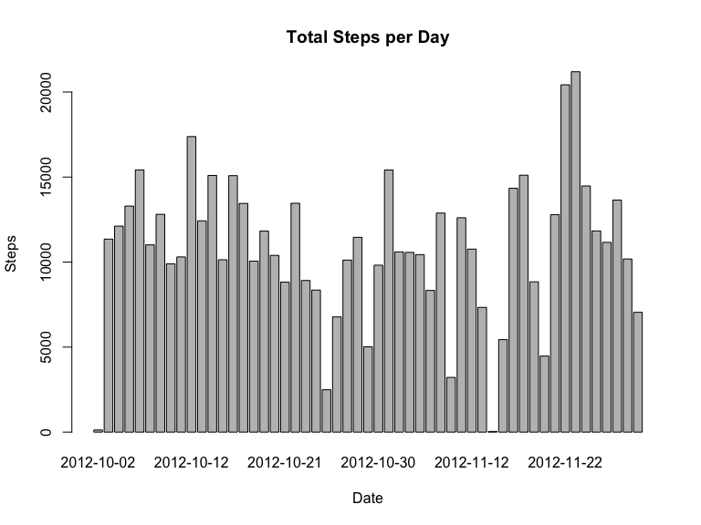
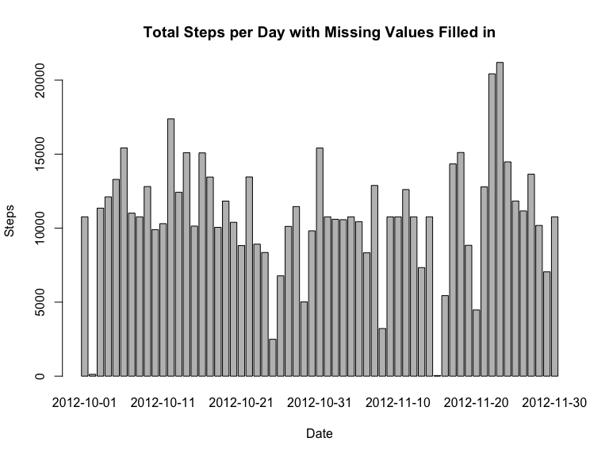
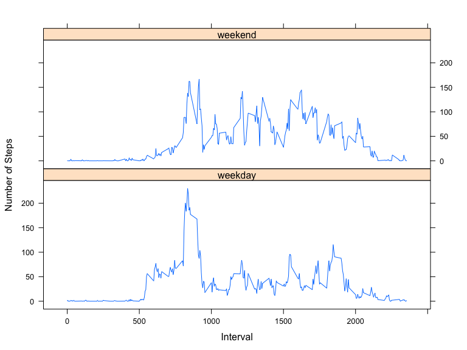

# Reproducible Research Peer Assessment 1
Annie Flippo  

## Introduction
This is prepared for the peer-assessed assignment 1 for the Coursera's Reproducible Research course.

## Loading and preprocessing the data

1. Load the data.

```r
setwd("~/Coursera-repo/ReproducibleResearch/RepData_PeerAssessment1")

# If datafile doesn't exist, unzip it
if (!file.exists("./activity.csv")) {
    unzip ("./activity.zip")
}

# Read the data file 
rawData <- read.csv("activity.csv", header=TRUE, sep=",", na.strings="NA", 
                    colClasses=c("numeric", "character", "numeric"),
                    col.names=c("steps", "date", "interval"))
```

2. Process/transform the data into a format suitable for analysis

```r
# Create tidyData excluding any missing values
tidyData <- subset(rawData, !is.na(rawData$steps))
tidyData$date <- as.Date(tidyData$date)

# Make it a data frame and set the column names
dateFactor <- factor(tidyData$date)
stepsPerDay <- tapply(tidyData$steps, dateFactor, sum, na.rm=TRUE)
stepsPerDay <- as.data.frame(stepsPerDay)
stepsPerDay <- cbind(row.names(stepsPerDay), stepsPerDay)
colnames(stepsPerDay) <- c("date", "totalSteps")
stepsPerDay$date <- as.Date(stepsPerDay$date)
```

## What is mean total number of steps taken per day?

1. Make a histogram of the total number of steps taken each day

```r
barplot(stepsPerDay$totalSteps, main="Total Steps per Day", xlab="Date", ylab="Steps")
```

 

2. Calculate and report mean and median steps per day

Mean steps per day is: 

```r
mean(stepsPerDay$totalSteps)
```

```
## [1] 10766
```

Median steps per day is:

```r
median(stepsPerDay$totalSteps)
```

```
## [1] 10765
```

## What is the average daily activity pattern?

1. Make a time series plot.


```r
# Make it a data frame and set the column names
intervalFactor <- factor(tidyData$interval)
meanStepsPerInt <- tapply(tidyData$steps, intervalFactor, mean, na.rm=TRUE)
meanStepsPerInt <- as.data.frame(meanStepsPerInt)
meanStepsPerInt <- cbind(row.names(meanStepsPerInt), meanStepsPerInt)
colnames(meanStepsPerInt) <- c("interval", "steps")

meanStepsPerInt$interval <- as.numeric(as.character(meanStepsPerInt$interval))
```


```r
plot(meanStepsPerInt$interval, meanStepsPerInt$steps, type="l", lwd=1, 
     main="Average Daily Activity", 
     xlab="Interval", ylab="Average Steps (per 5 minute interval)")
```

 

2. Which 5-minute interval, on average across all the days in the dataset, contains the maximum number of steps?


```r
# Order the previously calculated meanStepsPerInt in descending order
sIndex <- order(meanStepsPerInt$steps, decreasing=TRUE)
```

On average across all the days in the dataset, Interval 

```r
meanStepsPerInt[sIndex[1],]$interval
```

```
## [1] 835
```
contains the maximum number of steps.

## Imputing missing values

1. Calculate and report the total number of missing values in the dataset (i.e. the total number of rows with NAs).

```r
nrow(subset(rawData, is.na(rawData$steps)))
```

```
## [1] 2304
```

2. Devise a strategy for filling in all of the missing values in the dataset. The strategy does not need to be sophisticated. For example, you could use the mean/median for that day, or the mean for that 5-minute interval, etc.

**The method used here is to replace the missing values with the average number of steps for the same 5-minute interval.**

3. Create a new dataset that is equal to the original dataset but with the missing data filled in.


```r
# fillData will have its missing values for steps column imputted
fillData <- rawData
fillData$date <- as.Date(fillData$date)

for (i in 1:nrow(fillData)) {
    if (is.na(fillData[i,]$steps)) {
         stepsLookup <-
            meanStepsPerInt[which(meanStepsPerInt$interval==fillData$interval[i]), ]$steps 
            fillData$steps[i] <- stepsLookup
    }
}

dateFactor <- factor(fillData$date)
fillStepsPerDay <- tapply(fillData$steps, dateFactor, sum)
fillStepsPerDay <- as.data.frame(fillStepsPerDay)
fillStepsPerDay <- cbind(row.names(fillStepsPerDay), fillStepsPerDay)
colnames(fillStepsPerDay) <- c("date", "totalSteps")
```

5. Make a histogram of the total number of steps taken each day and Calculate and report the mean and median total number of steps taken per day. Do these values differ from the estimates from the first part of the assignment? What is the impact of imputing missing data on the estimates of the total daily number of steps?


```r
barplot(fillStepsPerDay$totalSteps, main="Total Steps per Day with Missing Values Filled in", 
    xlab="Date", ylab="Steps")
```

 

Calculate mean steps per day with missing data filled in:

```r
mean(fillStepsPerDay$totalSteps)
```

```
## [1] 10766
```

Calculate median steps per day for missing data filled in:

```r
median(fillStepsPerDay$totalSteps)
```

```
## [1] 10766
```

For most days, the imputted missing value did not have a big impact on the total daily steps, mean or median steps per day.  However, for days such as 2012-10-01 that had all missing values, the replacement of missing values had a big impact for that particular day.  For example, the **total daily steps** for 2012-10-01 changed from **NA** to **10,766** steps.

## Are there differences in activity patterns between weekdays and weekends?

1. Create a new factor variable in the dataset with two levels – “weekday” and “weekend” indicating whether a given date is a weekday or weekend day


```r
# weekDayOrWeekend will return "weekday" or "weekend" given a date
weekdayOrWeekend <- function (x) {
    x <- as.Date(x)
    dayOfWeek <- weekdays(x)
    
    if (dayOfWeek %in% c("Saturday","Sunday")) {
        "weekend"
    } else {
        "weekday"
    }
}

# determine fillData$date is a weekday or a weekend
wkDayOrEnd <- lapply(fillData$date, weekdayOrWeekend)

# lapply returns a list and then change it to a matrix
# append whether a date is a weekday or weekend to the data frame
wkDayOrEnd <- do.call(rbind, wkDayOrEnd)
fillData <- cbind(fillData, wkDayOrEnd)

# Include dplyr package in order to use: group_by and summarise
library(dplyr)
```

```
## 
## Attaching package: 'dplyr'
## 
## The following objects are masked from 'package:stats':
## 
##     filter, lag
## 
## The following objects are masked from 'package:base':
## 
##     intersect, setdiff, setequal, union
```

```r
# Include lattice package for the panel plot
library(lattice)

# Create a data frame with only weekday average of steps per interval
wkDayData <- filter(fillData, wkDayOrEnd == "weekday")

by_wkday_interval <- group_by(wkDayData, interval)
wkday_avg <- summarise(by_wkday_interval, 
  steps = mean(steps, na.rm = TRUE)
)

# Create a data frame with only weekend average of steps per interval
wkEndData <- filter(fillData, wkDayOrEnd == "weekend")
by_wkend_interval <- group_by(wkEndData, interval)
wkend_avg <- summarise(by_wkend_interval, 
  steps = mean(steps, na.rm = TRUE)
)

# Combined average of steps per interval with a new factor column, dayOfWeek
t_wkday <- cbind(wkday_avg, "weekday")
colnames(t_wkday) <- c("interval", "steps", "dayOfWeek")

t_wkend <- cbind(wkend_avg, "weekend")
colnames(t_wkend) <- c("interval", "steps", "dayOfWeek")

finalRes <- rbind(t_wkday, t_wkend)

day_of_week <- transform(finalRes, dayOfWeek = factor(dayOfWeek))
```

2. Make a panel plot containing a time series plot (i.e. type = "l") of the 5-minute interval (x-axis) and the average number of steps taken, averaged across all weekday days or weekend days (y-axis). 


```r
xyplot(steps ~ interval | dayOfWeek, data = finalRes, type="l", 
       xlab="Interval", ylab="Number of Steps", layout = c(1, 2))
```

 
